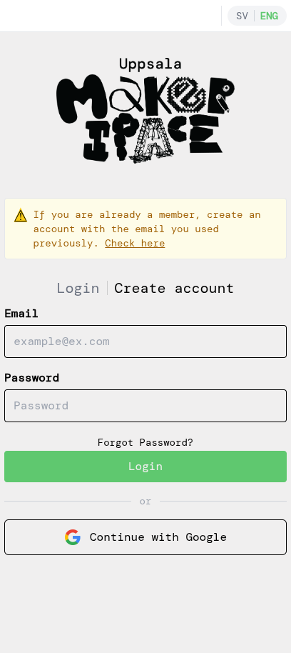
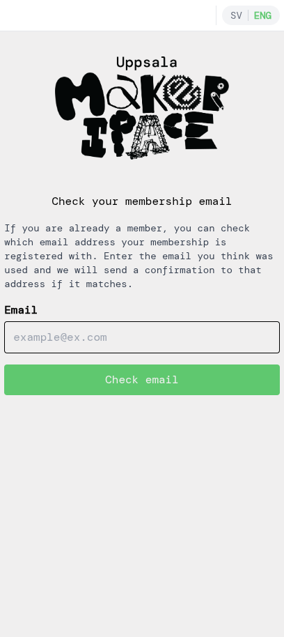
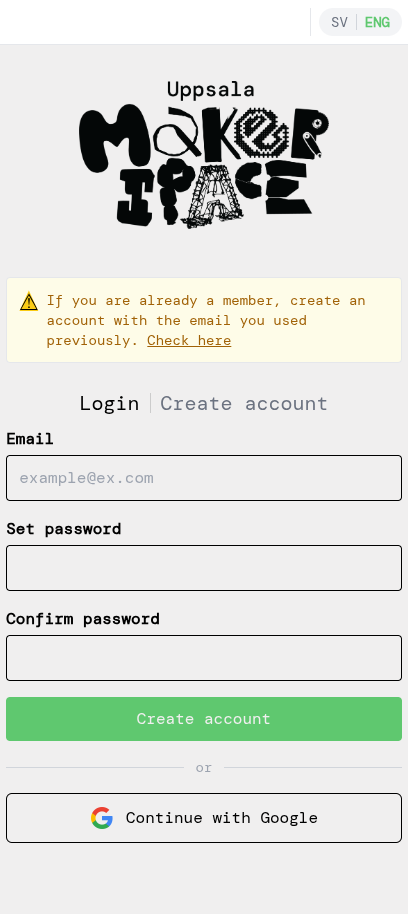
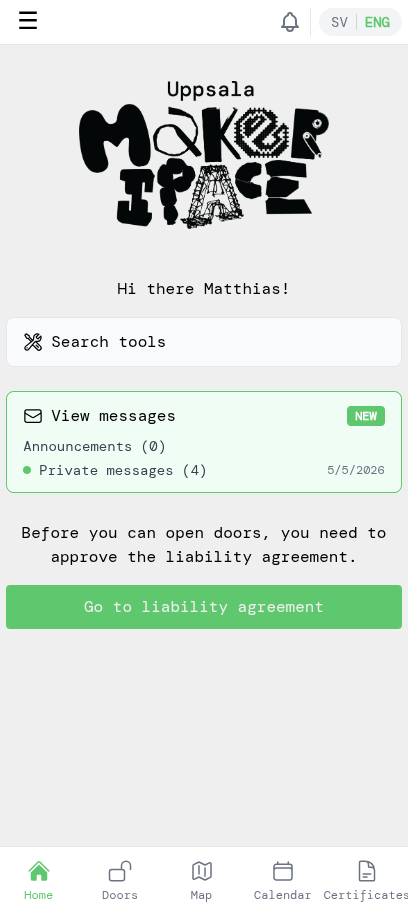
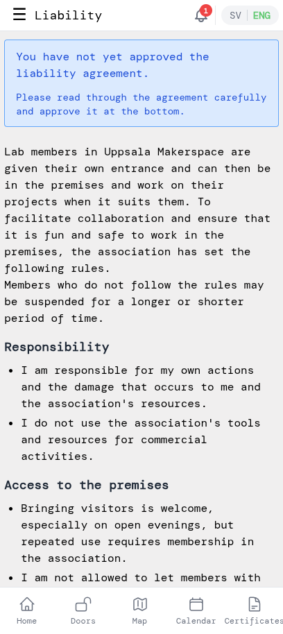
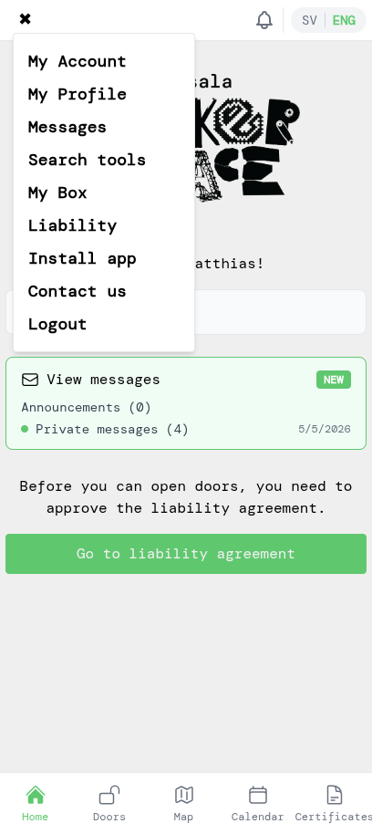
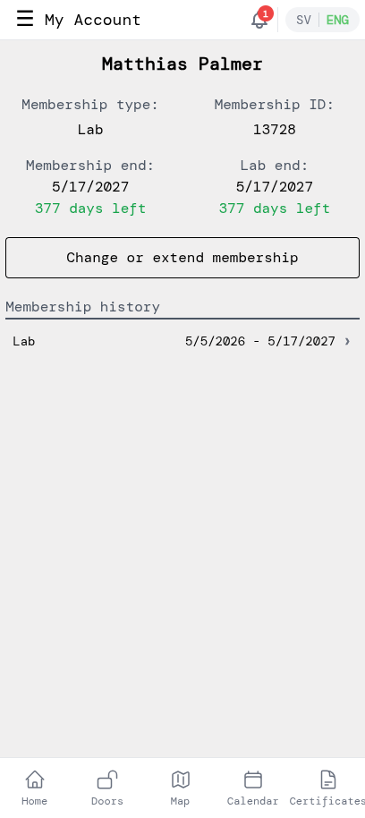
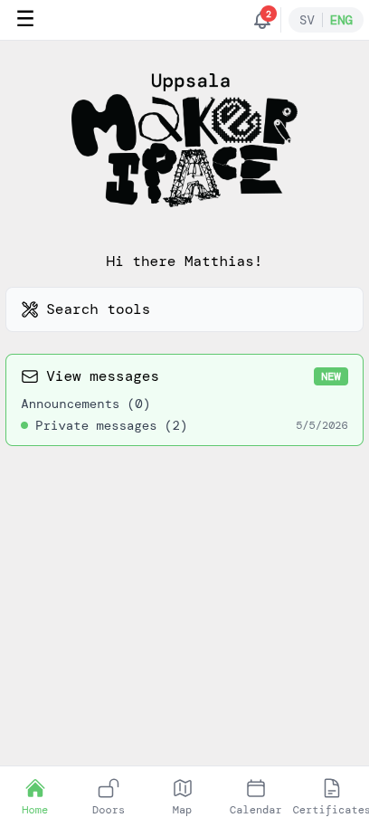
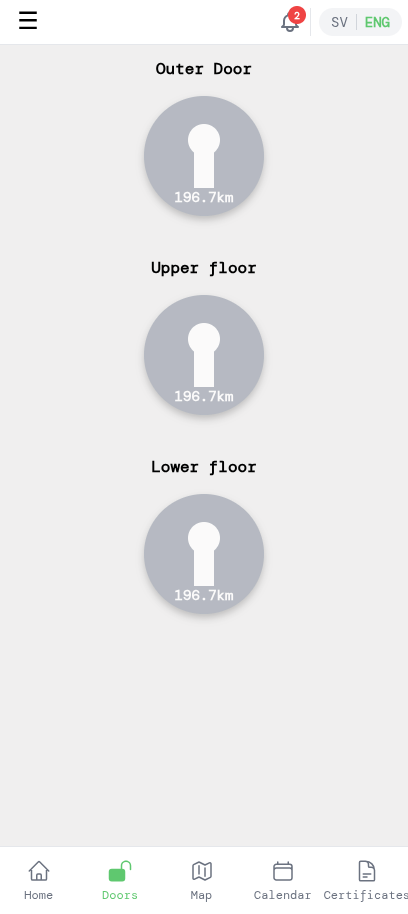

# Existing members — getting started

This tutorial is for you if you're already a paying member of Uppsala Makerspace but have never used the app before. You'll create an account that links to your existing membership, approve the latest liability agreement, and unlock the doors — no new payment needed.

## 1. Confirm your membership email

Open the app. The login screen shows a yellow note at the top: *If you are already a member, create an account with the email you used previously.* Tap **Check here** in that note to confirm we have your email on file.

Enter the email address you think you used when signing up. If it matches, you'll get a confirmation email. (If nothing arrives within a few minutes, it's likely that another email is on file — try another, or reach out to the board.)

## 2. Create an account

Once you've confirmed which email is on file, go back to the login screen and tap **Create account**. Use the same email — that's how the app links your new account to your existing membership.

Set a password and tap **Create account**. (Or use **Continue with Google** if the email on file is a Google account — that signs you in without a password.)

## 3. Verify your email

The app sends a verification link to your email. Open it and click the link to activate the account, then return to the app.

> If you used **Continue with Google**, your email is already verified — you can skip this step.

## 4. Approve the liability agreement

You'll land directly on the home screen — the app already has your name and membership details from our records, so you don't need to fill in a profile. The only thing standing between you and door access is the latest liability agreement; the app prompts you to approve it.

Tap **Go to liability agreement**.

Read through it carefully. Scroll to the bottom, tick the checkbox confirming you've read and understood it, and tap **Approve**.

## 5. See your membership and your profile

Open the side menu by tapping the **☰** icon in the top-left. You'll see entries for *My Account*, *My Profile*, and more.

Tap **My Account** to see your membership type, membership ID, end dates, days left, and the history of your past memberships. If something looks wrong, contact the board.

While you're here, tap **My Profile** in the same menu to review the name, gender, birth year, phone number, and RFID tag we have on you. Update anything that's out of date — your phone number is what we use to reach you, and an accurate RFID tag is needed if you're certified to use machines that require unlocking.

## 6. Open doors

Back on the home screen everything should be clean — no more pending steps.

If you have lab access, tap **Doors** in the bottom navigation. Each door tile shows your distance to it; tap a tile to unlock it (you need to be near the makerspace for the unlock to work).

You're all set — welcome to the app!
