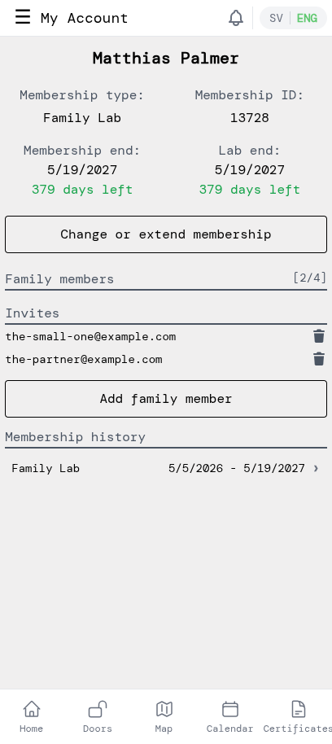
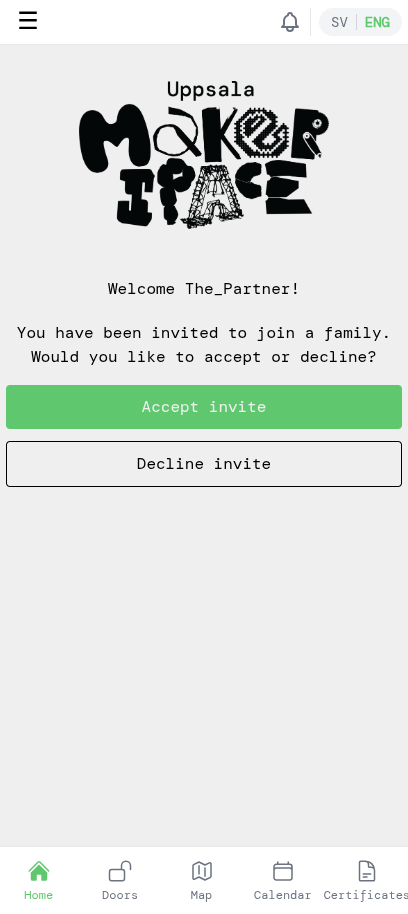
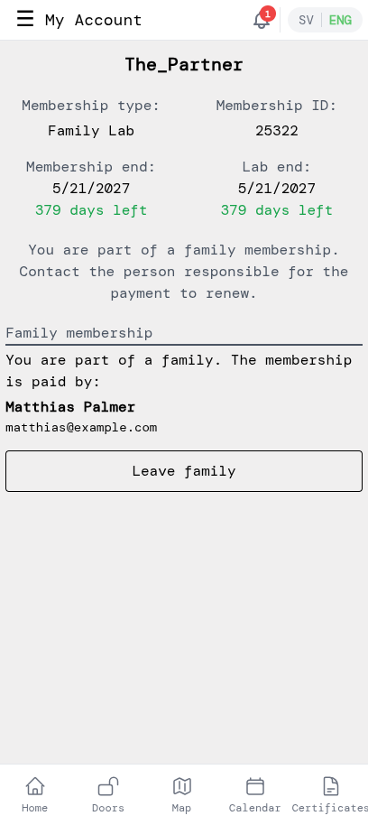

# Manage family members

A family membership covers up to 5 people at the same address — either Family Basic or Family Lab. As the membership holder you invite the others into your family from inside the app; they accept on their own device. This tutorial walks through the whole loop — sending an invite, the family member creating their account, accepting, and how either of you can manage things later. The screenshots show a Family Lab example; the flow is identical for Family Basic.

## 1. Open your family membership

Open the side menu by tapping the **☰** icon and pick **My Account**. If you have a family membership, the page shows a *Family members* section with a `[used/max]` slot count and an *Invites* list. Each pending invite has a trash icon for revoking it.

## 2. Send an invite

Tap **Add family member**, enter the email address of the person you want to add, and confirm. The app sends them a short email with a link.

The pending invite appears in the *Invites* list immediately. If you change your mind, tap the trash icon next to the email to cancel it before they accept.

You can have up to 5 people in the family in total (yourself plus 4 others).

## 3. The family member creates an account

The invitee opens the email and follows the link to the app. They create an account using the same email you sent the invite to — that's how the app links them to your family. Walk-through for the account creation and email-verification flow is in **New members — getting started**, steps 1–3.

> If the invitee creates an account with a *different* email, the invite won't link. They should sign up with the exact address you sent the invite to.

## 4. They accept (or decline)

After verifying their email, the invitee lands on a welcome screen with the choice to accept or decline.

If they tap **Accept invite**, they become a family member with their own family membership tied to your payment. If they tap **Decline invite**, the invite is dropped — you can re-invite them later if needed.

## 5. The family member's view

After accepting, the family member's *My Account* shows their own membership ID, the same end dates as yours, and a note that they're part of a family. The membership is paid by you.

If the family member ever wants to leave — to switch to their own membership, or because the household is changing — they tap **Leave family**. Their family membership ends and the slot frees up on your account so you can invite someone else.

Back on your own *My Account*, the new family member moves out of the *Invites* list and into the *Family members* count. From there you can keep adding people up to the family limit at any time.
