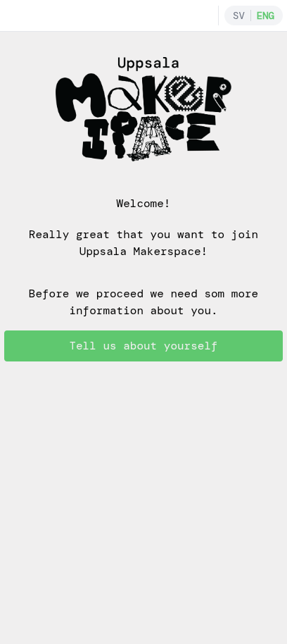
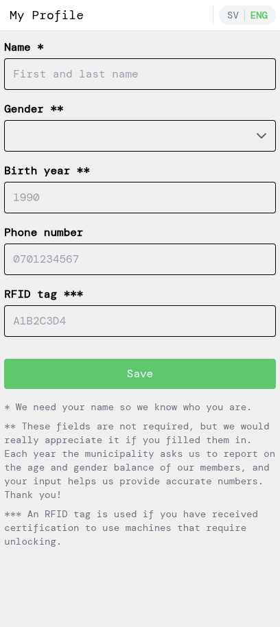
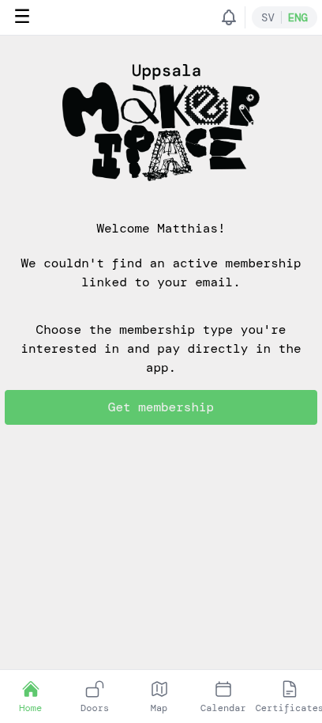
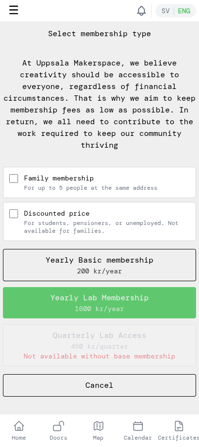
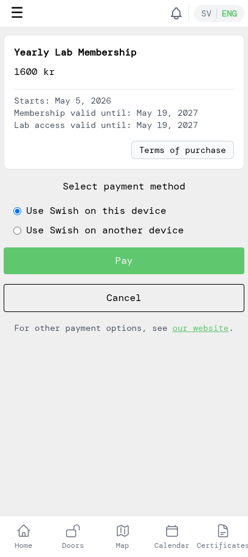
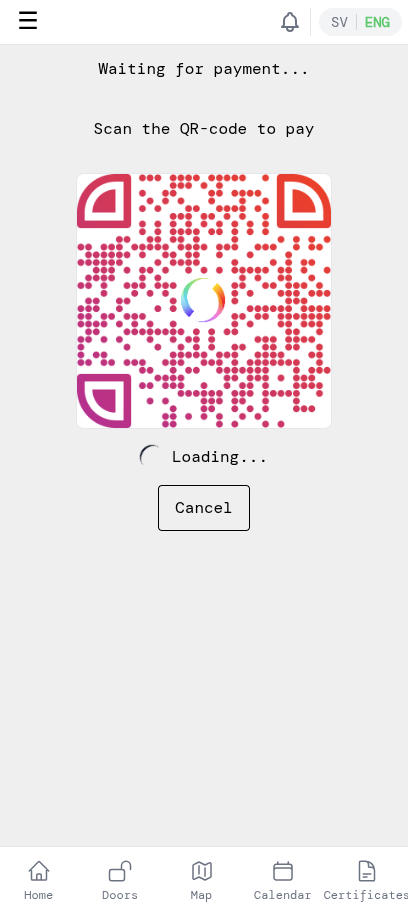
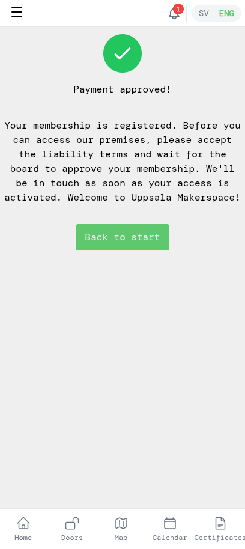
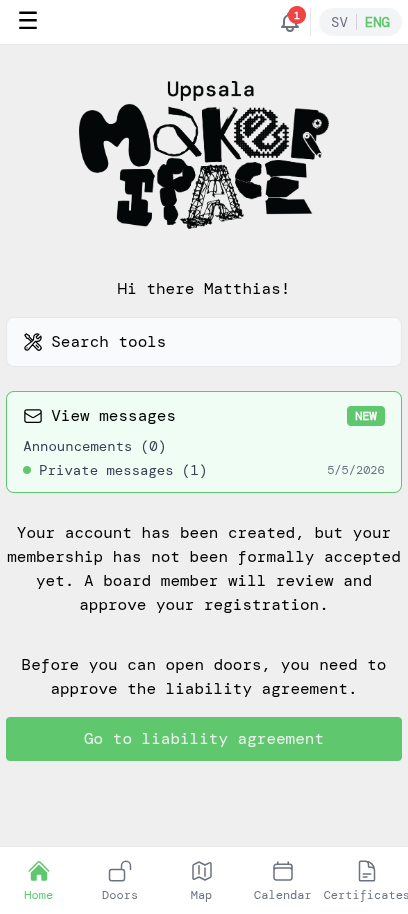
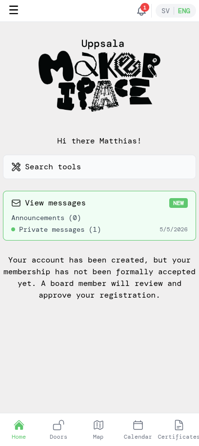

# New members — getting started

This tutorial walks you through joining Uppsala Makerspace as a new member from inside the app: creating an account, paying for a membership, approving the liability agreement, and unlocking the doors once the board has approved you.

These screenshots show the **Yearly Lab Membership** flow. If you instead want a Family membership or qualify for the Discounted price (students, pensioners, unemployed), tick the corresponding box on the membership selection screen — the rest of the steps are the same.

## 1. Create an account

Open the app. You'll land on the login screen. Tap **Create account** to switch to the sign-up form.

Enter your email, choose a password, and confirm it. Then tap **Create account**. (You can also use **Continue with Google** if you'd rather sign in with your Google account.)

## 2. Verify your email

The app will send a verification email to the address you used. Open it and click the verification link to activate the account, then return to the app.

> If you signed up with **Continue with Google**, your email is already verified — you can skip this step.

## 3. Tell us about yourself

After verifying, the app shows a welcome message. Tap **Tell us about yourself** to fill in your member profile.

Enter at least your **name** (required). The other fields are optional but appreciated — the municipality asks us each year to report on age and gender balance, and an RFID tag is needed later if you get certified to use machines that require unlocking. Tap **Save** when you're done.

## 4. Choose a membership

You'll be taken to the home screen. There's no active membership yet, so you'll see a prompt to pick one. Tap **Get membership**.

Pick the membership type that fits you. Most members choose **Yearly Lab Membership** (1600 kr/year), which gives you your own access to the premises. The basic membership alone (200 kr/year) is also available, but doesn't include lab access.

If you want a **Family membership** (up to 5 people at the same address) or you qualify for the **Discounted price** (students, pensioners, unemployed), tick the corresponding box at the top before picking the membership.

## 5. Pay with Swish

Review the membership summary (price, validity dates) and tap **Pay**. Keep **Use Swish on this device** selected if you have Swish installed on the same phone you're using; pick **Use Swish on another device** if Swish lives on a different phone.

The app shows a QR code and waits for the payment. Open Swish (on the same device it'll open automatically; on another device, scan the QR code) and approve the payment there. Then return to the app.

Once Swish has confirmed, the app shows that the payment went through.

Tap **Back to start** to return to the home screen. You'll also receive a confirmation email about the payment.

## 6. Approve the liability agreement

Back on the home screen you'll see two things you still need to take care of: the board hasn't approved you yet, and you haven't approved the liability agreement. Tap **Go to liability agreement**.

Read through the agreement carefully. Scroll to the bottom, tick the checkbox confirming you've read and understood it, and tap **Approve**.

## 7. Wait for board approval

After approving the liability, the home screen will show that you're now only waiting on the board to formally accept your membership. A board member reviews new registrations and the system sends you a welcome email once you've been approved.

## 8. You're in

Once the board has approved you, the home screen looks clean — no more pending steps. You're a full lab member.

Tap **Doors** in the bottom navigation to unlock doors when you're at the makerspace. Each door tile shows your distance to it; tap a tile to unlock it (you need to be near the makerspace for the unlock to work).

Welcome to Uppsala Makerspace!
