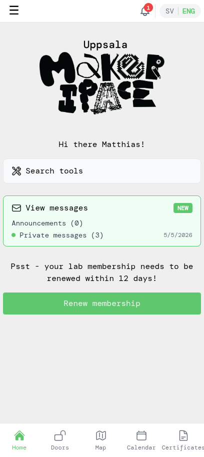

# Renew your membership

This tutorial walks you through renewing your membership before it expires. The flow assumes you already use the app and are signed in. The renewal pays for another period — yearly basic, yearly lab, or quarterly lab — via Swish, and your membership is extended immediately once the payment goes through.

## 1. Notice the renewal reminder

The app starts reminding you 14 days before your membership ends. You'll see two kinds of reminder:

- A confirmation email goes out 14 days before the end date so you know it's time.
- The home screen shows a yellow reminder strip and a **Renew membership** button. As the end date gets closer the app will also start sending push notifications (if you've allowed them on your phone) so you don't forget.

When you open the app and see the renewal prompt, tap **Renew membership** to start.

## 2. Choose a membership

Pick the membership that fits you. Most members keep the same option they had last year — typically **Yearly Lab Membership** (1600 kr/year), which gives you your own access to the premises. The basic membership alone (200 kr/year) is also available, but doesn't include lab access. Quarterly lab access is an option if you have an active basic membership.

If you're switching to a **Family membership** (up to 5 people at the same address) or now qualify for the **Discounted price** (students, pensioners, unemployed), tick the corresponding box at the top before picking the membership.

## 3. Pay with Swish

Review the membership summary (price, validity dates) and tap **Pay**. Keep **Use Swish on this device** selected if you have Swish installed on the same phone you're using; pick **Use Swish on another device** if Swish lives on a different phone.

The app shows a QR code and waits for the payment. Open Swish (on the same device it'll open automatically; on another device, scan the QR code) and approve the payment there. Then return to the app.

Once Swish has confirmed, the app shows that the payment went through. You'll also receive a confirmation email about the payment.

Tap **Back to start** to return to the home screen.

## 4. See your updated membership

Open the side menu by tapping the **☰** icon in the top-left, then pick **My Account**.

The end dates have moved out by a year (or a quarter, if you renewed quarterly), the days-left counter has reset, and the new payment is at the top of the membership history.

## 5. Carry on

Back on the home screen the renewal reminder is gone — your membership is good for another period.

If you have lab access, tap **Doors** in the bottom navigation to unlock when you're at the makerspace.

That's it — see you in the lab!
