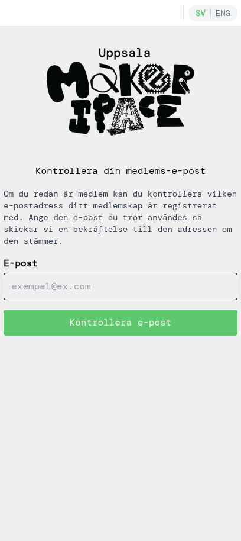
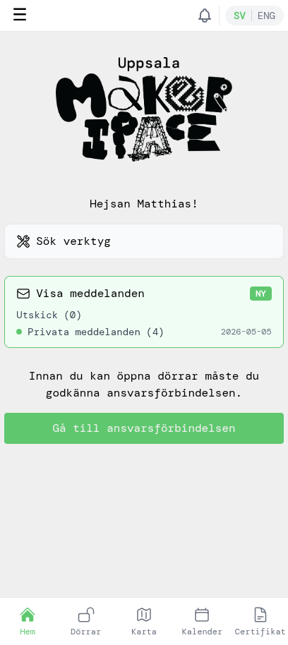

# Befintliga medlemmar — kom igång

Den här guiden är för dig som redan är betalande medlem i Uppsala Makerspace men aldrig har använt appen förut. Du skapar ett konto som kopplas till ditt befintliga medlemskap, godkänner den senaste ansvarsförbindelsen och kan låsa upp dörrarna — ingen ny betalning behövs.

## 1. Kontrollera din medlems-e-post

Öppna appen. Inloggningssidan visar en gul ruta överst: *Om du redan är medlem, skapa då ett konto med den e-post du använt tidigare.* Tryck på **Kontrollera här** i den rutan för att bekräfta att vi har din e-post i registret.

Skriv in den e-postadress du tror att du använde när du blev medlem. Om den finns i registret får du ett bekräftelsemejl. (Om inget kommer fram inom några minuter har du troligen en annan e-post i registret — pröva en annan, eller hör av dig till styrelsen.)

## 2. Skapa ett konto

När du har bekräftat vilken e-post som finns i registret går du tillbaka till inloggningssidan och trycker på **Skapa konto**. Använd samma e-post — det är så appen kopplar ihop ditt nya konto med ditt befintliga medlemskap.

Välj ett lösenord och tryck på **Skapa konto**. (Eller välj **Fortsätt med Google** om e-posten i registret är ett Google-konto — då loggas du in utan lösenord.)

## 3. Bekräfta din e-post

Appen skickar en bekräftelselänk till din e-post. Öppna mejlet och klicka på länken för att aktivera kontot, och återvänd sedan till appen.

> Om du använde **Fortsätt med Google** är din e-post redan verifierad — du kan hoppa över detta steg.

## 4. Godkänn ansvarsförbindelsen

Du kommer direkt till hemsidan — appen har redan ditt namn och dina medlemsuppgifter från registret, så du behöver inte fylla i någon profil. Det enda som står mellan dig och tillträde till lokalen är den senaste ansvarsförbindelsen; appen uppmanar dig att godkänna den.

Tryck på **Gå till ansvarsförbindelsen**.

Läs igenom den noggrant. Scrolla längst ner, kryssa i rutan som bekräftar att du har läst och förstått den, och tryck på **Godkänn**.

## 5. Se ditt medlemskap och din profil

Öppna sidomenyn genom att trycka på **☰**-ikonen uppe till vänster. Där ser du bland annat *Mitt konto* och *Min profil*.

Tryck på **Mitt konto** för att se din medlemskapstyp, ditt medlems-ID, slutdatum, antal dagar kvar och historiken över dina tidigare medlemskap. Om något ser fel ut, hör av dig till styrelsen.

Tryck också på **Min profil** i samma meny för att se över ditt namn, kön, födelseår, telefonnummer och RFID-tagg som vi har registrerat på dig. Uppdatera det som är inaktuellt — telefonnumret är hur vi når dig, och en korrekt RFID-tagg behövs om du blir certifierad för att använda maskiner som kräver upplåsning.

## 6. Öppna dörrar

Tillbaka på hemsidan ska allt vara rent — inga fler väntande steg.

Om du har labbåtkomst, tryck på **Dörrar** i bottennavigeringen. Varje dörrbricka visar avståndet till dörren; tryck på en bricka för att låsa upp den (du måste vara nära makerspacet för att upplåsningen ska fungera).

Du är klar — välkommen in i appen!
