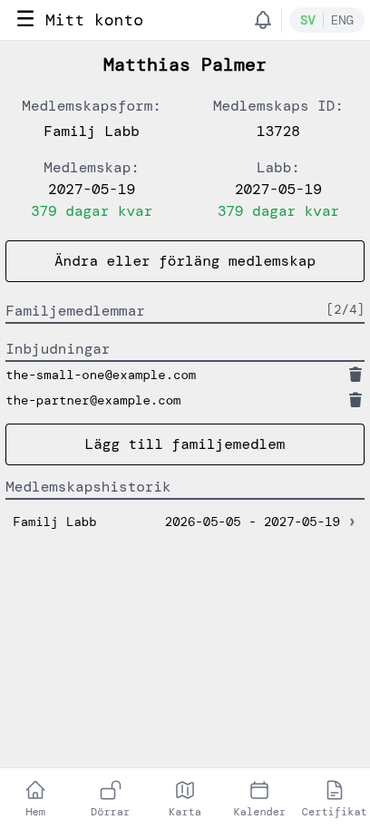
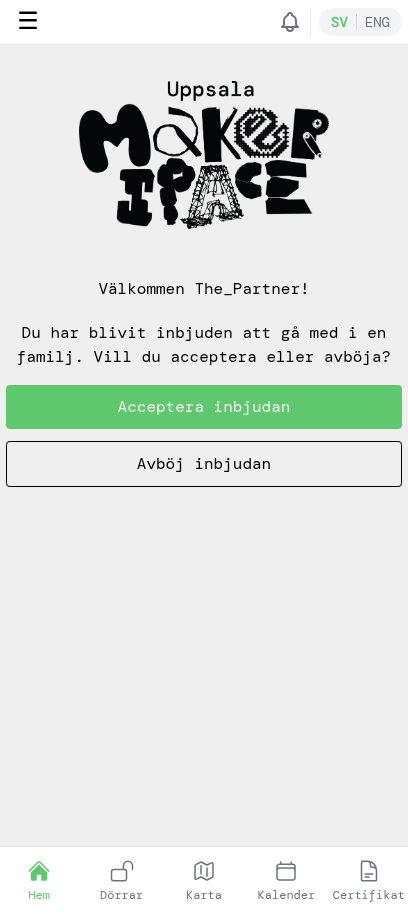
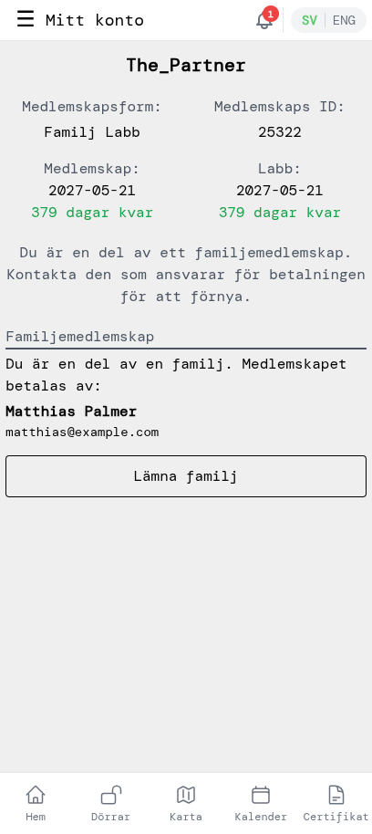

# Hantera familjemedlemmar

Ett familjemedlemskap omfattar upp till 5 personer på samma adress — antingen Familj Bas eller Familj Labb. Som medlemskapsinnehavare bjuder du in övriga till din familj inifrån appen; de accepterar på sin egen enhet. Den här guiden går igenom hela kedjan — skicka en inbjudan, familjemedlemmen skapar sitt konto, accepterar och hur ni båda kan hantera saker senare. Skärmbilderna visar ett Familj Labb-exempel; flödet är identiskt för Familj Bas.

## 1. Öppna ditt familjemedlemskap

Öppna sidomenyn genom att trycka på **☰**-ikonen och välj **Mitt konto**. Om du har ett familjemedlemskap visar sidan en *Familjemedlemmar*-sektion med en `[använda/max]`-räknare och en *Inbjudningar*-lista. Varje väntande inbjudan har en papperskorgsikon för att återkalla den.

## 2. Skicka en inbjudan

Tryck på **Lägg till familjemedlem**, skriv in e-postadressen till personen du vill lägga till och bekräfta. Appen skickar ett kort mejl med en länk till dem.

Den väntande inbjudan dyker genast upp i *Inbjudningar*-listan. Om du ångrar dig, tryck på papperskorgsikonen bredvid e-posten för att avbryta innan de accepterar.

Ni kan vara upp till 5 personer totalt i familjen (du själv plus 4 andra).

## 3. Familjemedlemmen skapar ett konto

Den inbjudna öppnar mejlet och följer länken till appen. De skapar ett konto med samma e-post som du skickade inbjudan till — det är så appen kopplar ihop dem med din familj. Genomgång av kontoskapande och e-postverifiering finns i **Nya medlemmar — kom igång**, steg 1–3.

> Om den inbjudna skapar ett konto med en *annan* e-post kopplas inte inbjudan. De måste registrera sig med exakt samma adress som du skickade inbjudan till.

## 4. De accepterar (eller avböjer)

Efter att ha verifierat sin e-post landar den inbjudna på en välkomstsida med valet att acceptera eller avböja.

Om de trycker på **Acceptera inbjudan** blir de en familjemedlem med ett eget familjemedlemskap kopplat till din betalning. Om de trycker på **Avböj inbjudan** dras inbjudan tillbaka — du kan bjuda in dem igen senare om det behövs.

## 5. Familjemedlemmens vy

Efter att de har accepterat visar familjemedlemmens *Mitt konto* deras eget medlemskaps-ID, samma slutdatum som dina och en notis om att de är en del av en familj. Medlemskapet betalas av dig.

Om familjemedlemmen någon gång vill lämna familjen — för att byta till ett eget medlemskap, eller för att hushållet förändras — trycker de på **Lämna familj**. Deras familjemedlemskap upphör och platsen frigörs på ditt konto så att du kan bjuda in någon annan.

Tillbaka på ditt eget *Mitt konto* flyttas den nya familjemedlemmen ut ur *Inbjudningar*-listan och räknas i *Familjemedlemmar*-räknaren. Därifrån kan du fortsätta lägga till personer upp till familjegränsen när som helst.
