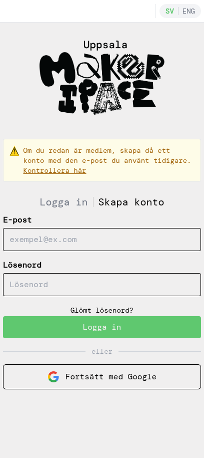
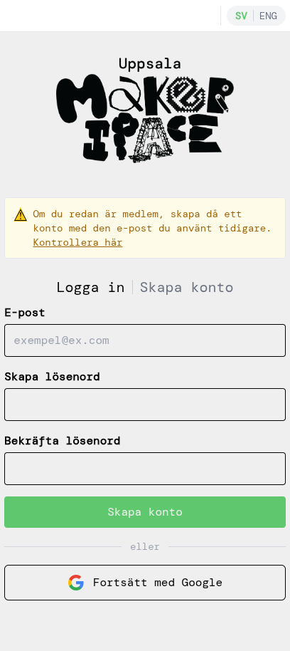
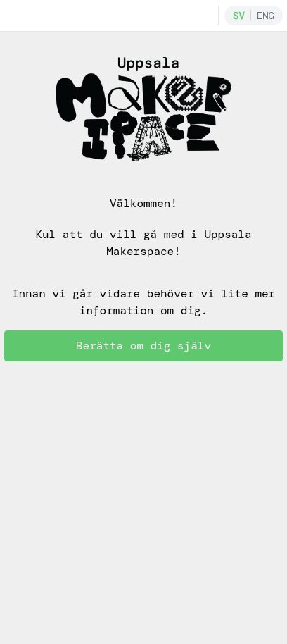
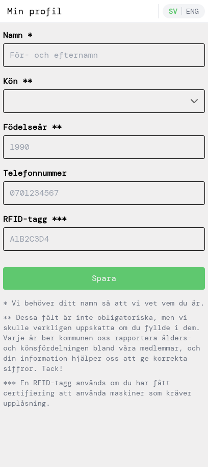
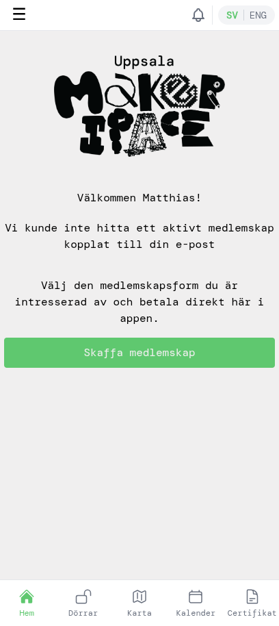
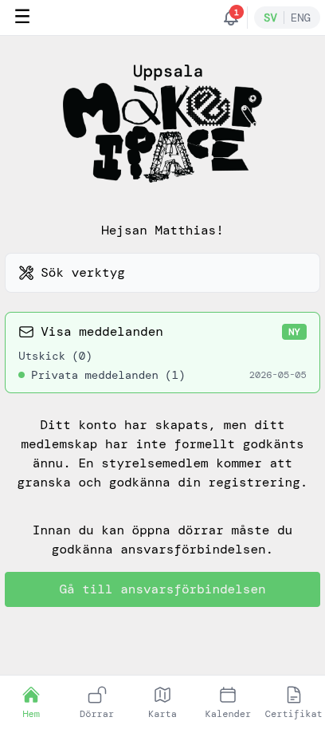
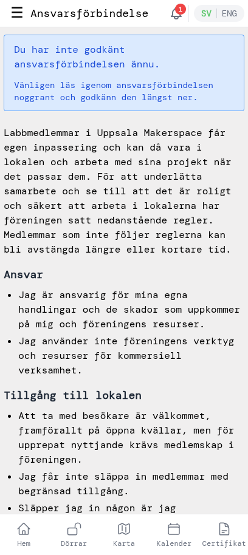
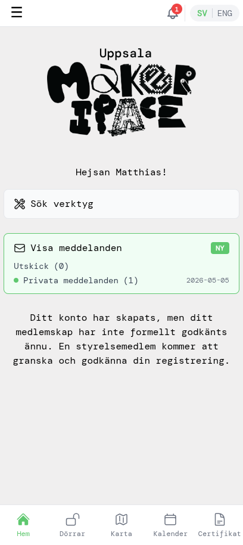

# Nya medlemmar — kom igång

Den här guiden visar hur du blir ny medlem i Uppsala Makerspace direkt från appen: skapa ett konto, betala medlemskap, godkänna ansvarsförbindelsen och låsa upp dörrar när styrelsen har godkänt dig.

Skärmbilderna visar flödet för **Årligt Medlemskap Labb**. Om du istället vill ha ett familjemedlemskap eller har rätt till reducerat pris (studenter, pensionärer, arbetslösa), kryssa i motsvarande ruta på sidan där du väljer medlemskap — övriga steg är desamma.

## 1. Skapa ett konto

Öppna appen. Du kommer till inloggningssidan. Tryck på **Skapa konto** för att växla till registreringsformuläret.

Fyll i din e-post, välj ett lösenord och bekräfta det. Tryck sedan på **Skapa konto**. (Du kan också använda **Fortsätt med Google** om du hellre vill logga in med ditt Google-konto.)

## 2. Bekräfta din e-post

Appen skickar ett bekräftelsemejl till adressen du angav. Öppna mejlet och klicka på bekräftelselänken för att aktivera kontot, och återvänd sedan till appen.

> Om du registrerade dig med **Fortsätt med Google** är din e-post redan verifierad — du kan hoppa över detta steg.

## 3. Berätta om dig själv

Efter verifieringen visar appen ett välkomstmeddelande. Tryck på **Berätta om dig själv** för att fylla i din medlemsprofil.

Fyll i åtminstone ditt **namn** (obligatoriskt). De övriga fälten är frivilliga men uppskattas — kommunen ber oss varje år rapportera ålders- och könsfördelning, och en RFID-tagg behövs senare om du blir certifierad för att använda maskiner som kräver upplåsning. Tryck på **Spara** när du är klar.

## 4. Välj ett medlemskap

Du kommer till hemsidan. Det finns inget aktivt medlemskap än, så du ser en uppmaning att välja ett. Tryck på **Skaffa medlemskap**.

Välj den medlemskapsform som passar dig. De flesta väljer **Årligt Medlemskap Labb** (1600 kr/år), som ger dig egen åtkomst till lokalen. Det går också att enbart välja basmedlemskap (200 kr/år), men det inkluderar inte labbåtkomst.

Om du vill ha ett **Familjemedlemskap** (upp till 5 personer på samma adress) eller har rätt till **Reducerat pris** (studenter, pensionärer, arbetslösa), kryssa i motsvarande ruta längst upp innan du väljer medlemskap.

## 5. Betala med Swish

Granska sammanfattningen (pris, giltighetstid) och tryck på **Betala**. Behåll **Använd Swish på denna enhet** om du har Swish installerat på samma telefon du använder; välj **Använd Swish på annan enhet** om Swish finns på en annan telefon.

Appen visar en QR-kod och väntar på betalningen. Öppna Swish (på samma enhet öppnas appen automatiskt; på en annan enhet, skanna QR-koden) och godkänn betalningen där. Återvänd sedan till appen.

När Swish har bekräftat visar appen att betalningen gick igenom.

Tryck på **Till startsidan** för att återvända till hemsidan. Du får också ett bekräftelsemejl om betalningen.

## 6. Godkänn ansvarsförbindelsen

Tillbaka på hemsidan ser du två saker som fortfarande behöver hanteras: styrelsen har inte godkänt dig än och du har inte godkänt ansvarsförbindelsen. Tryck på **Gå till ansvarsförbindelsen**.

Läs igenom ansvarsförbindelsen noggrant. Scrolla längst ner, kryssa i rutan som bekräftar att du har läst och förstått den, och tryck på **Godkänn**.

## 7. Vänta på styrelsens godkännande

Efter att du har godkänt ansvarsförbindelsen visar hemsidan att du nu bara väntar på att styrelsen ska formellt godkänna ditt medlemskap. En styrelsemedlem granskar nya registreringar och systemet skickar dig ett välkomstmejl när du har godkänts.

## 8. Klart!

När styrelsen har godkänt dig är hemsidan ren — inga fler väntande steg. Du är nu fullvärdig labbmedlem.

Tryck på **Dörrar** i bottennavigeringen för att låsa upp dörrar när du är på makerspacet. Varje dörrbricka visar avståndet till dörren; tryck på en bricka för att låsa upp den (du måste vara nära makerspacet för att upplåsningen ska fungera).

Välkommen till Uppsala Makerspace!
