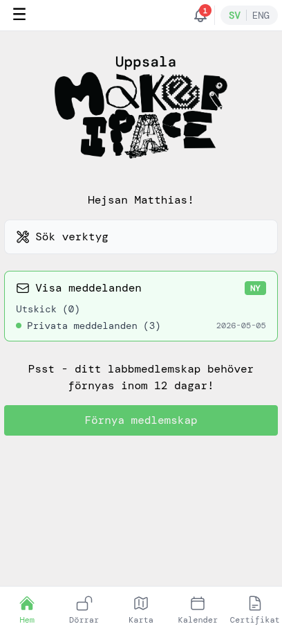
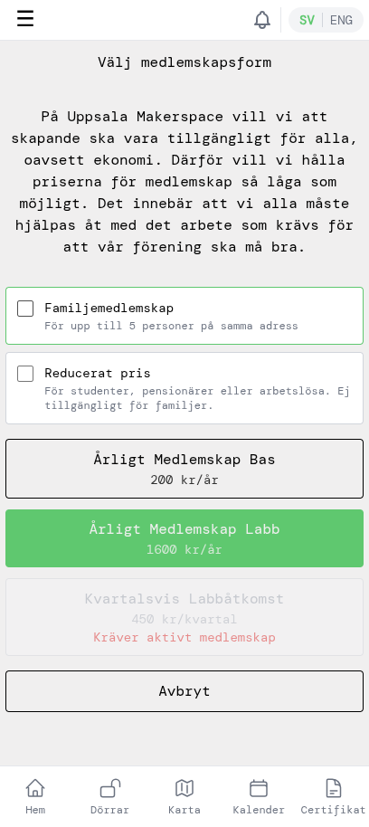
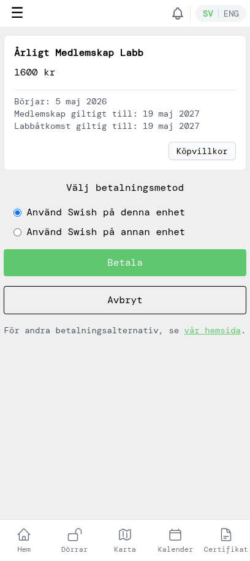
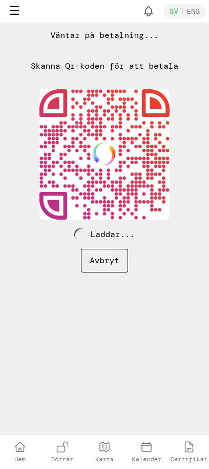
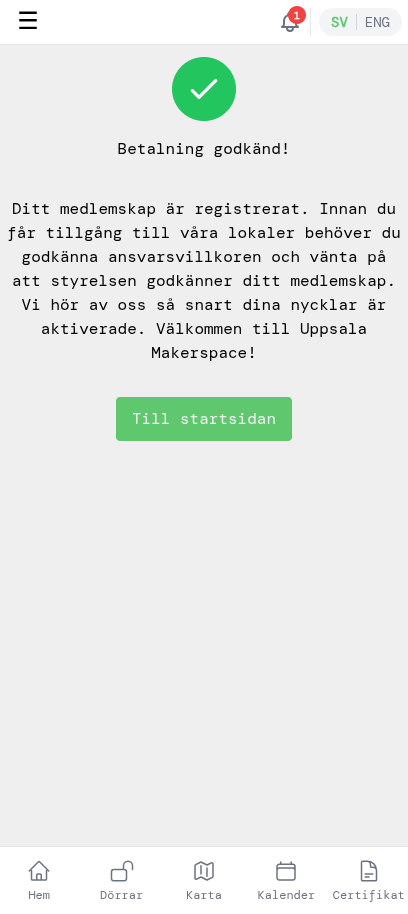
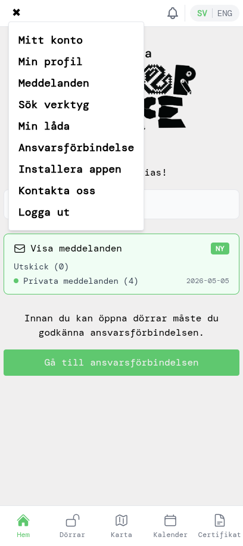
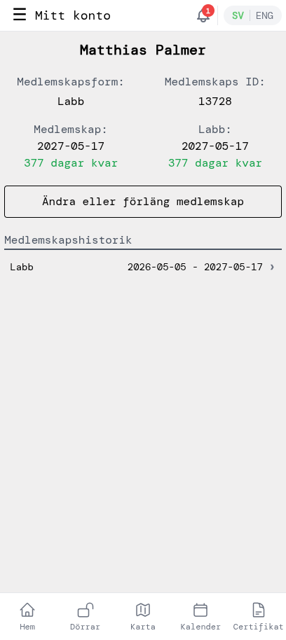
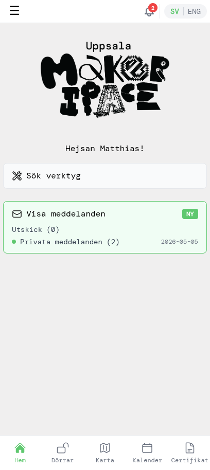
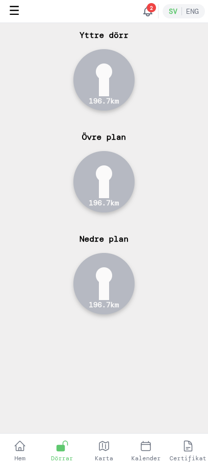

# Förnya ditt medlemskap

Den här guiden visar hur du förnyar ditt medlemskap innan det går ut. Den utgår från att du redan använder appen och är inloggad. Förnyelsen betalar för en ny period — årligt basmedlemskap, årligt labbmedlemskap eller kvartalsvis labbåtkomst — via Swish, och ditt medlemskap förlängs direkt så snart betalningen gått igenom.

## 1. Lägg märke till påminnelsen

Appen börjar påminna dig 14 dagar innan ditt medlemskap löper ut. Det sker på två sätt:

- Ett påminnelsemejl skickas 14 dagar innan slutdatumet så du vet att det är dags.
- Hemsidan visar en gul påminnelseruta med en **Förnya medlemskap**-knapp. Ju närmare slutdatumet du kommer, desto oftare skickar appen även push-notiser (om du har tillåtit dem på din telefon) så att du inte glömmer bort det.

När du öppnar appen och ser påminnelsen, tryck på **Förnya medlemskap** för att börja.

## 2. Välj medlemskap

Välj det medlemskap som passar dig. De flesta behåller samma alternativ som året innan — vanligtvis **Årligt Medlemskap Labb** (1600 kr/år), som ger dig egen åtkomst till lokalen. Det går också att enbart välja basmedlemskap (200 kr/år), men det inkluderar inte labbåtkomst. Kvartalsvis labbåtkomst är ett alternativ om du har ett aktivt basmedlemskap.

Om du byter till **Familjemedlemskap** (upp till 5 personer på samma adress) eller har börjat ha rätt till **Reducerat pris** (studenter, pensionärer, arbetslösa), kryssa i motsvarande ruta längst upp innan du väljer medlemskap.

## 3. Betala med Swish

Granska sammanfattningen (pris, giltighetstid) och tryck på **Betala**. Behåll **Använd Swish på denna enhet** om du har Swish installerat på samma telefon du använder; välj **Använd Swish på annan enhet** om Swish finns på en annan telefon.

Appen visar en QR-kod och väntar på betalningen. Öppna Swish (på samma enhet öppnas appen automatiskt; på en annan enhet, skanna QR-koden) och godkänn betalningen där. Återvänd sedan till appen.

När Swish har bekräftat visar appen att betalningen gick igenom. Du får också ett bekräftelsemejl om betalningen.

Tryck på **Till startsidan** för att återvända till hemsidan.

## 4. Se ditt uppdaterade medlemskap

Öppna sidomenyn genom att trycka på **☰**-ikonen uppe till vänster och välj sedan **Mitt konto**.

Slutdatumen har flyttats fram med ett år (eller ett kvartal, om du förnyade kvartalsvis), antalet dagar kvar har återställts, och den nya betalningen ligger överst i medlemskapshistoriken.

## 5. Fortsätt som vanligt

Tillbaka på hemsidan är påminnelsen borta — ditt medlemskap är aktivt en period till.

Om du har labbåtkomst, tryck på **Dörrar** i bottennavigeringen för att låsa upp när du är på makerspacet.

Det var det — vi ses i labbet!
